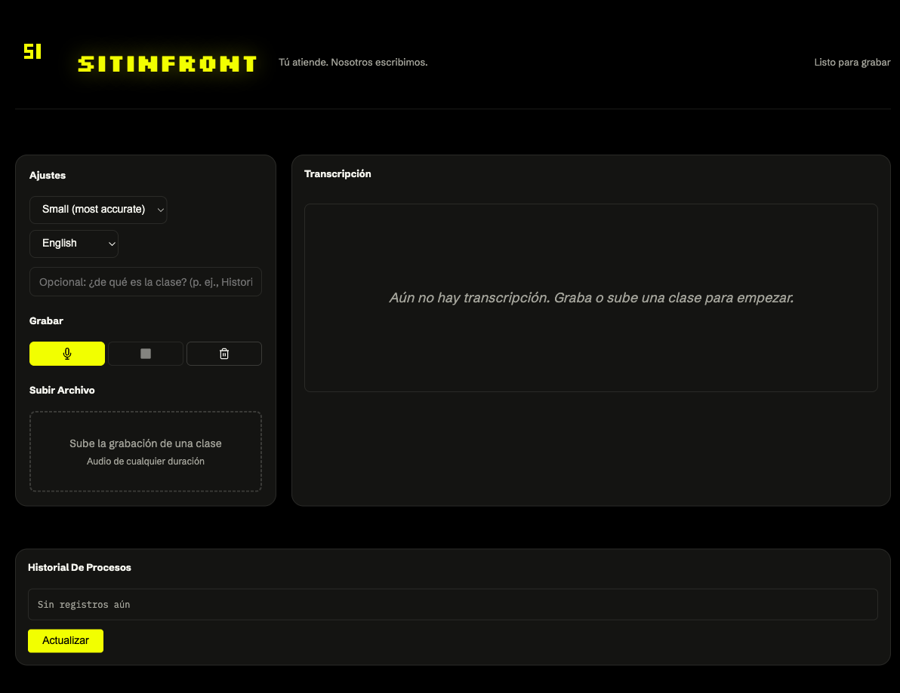

<div align="center">
  

  # sitinfront

  ### Tú atiende. Nosotros escribimos.
  *You pay attention. We write it down.*

  [](LICENSE)
  [](https://github.com/OpenNMT/CTranslate2)
  [](https://github.com/openai/whisper)
  [](#api-reference)

</div>

---

Sitting in the front row is the best way not to miss anything. sitinfront brings that seat to anyone, in any class, however long it runs — upload the recording, get the whole thing back, word for word, with a timestamp on every sentence. You stop copying things down and go back to listening, asking questions, thinking.

<div align="center">
  
</div>

## What it does

- **Complete.** Full 2-3 hour lectures, transcribed in full — no summaries that quietly skip what the professor said at minute 97.
- **Present.** Segments stream in as they're transcribed. You're not staring at a spinner; you're already reading, while it keeps going.
- **Findable.** Every sentence has its own minute. Search for "what she said about the exam" and it takes you exactly there.
- **Honest when it breaks.** A failed chunk retries automatically; if it still can't be read, you're told which minute and why, not left guessing. What did transcribe is never thrown away.

## How it works

sitinfront is a speech-to-text web app built on [faster-whisper](https://github.com/SYSTRAN/faster-whisper) (a CTranslate2 reimplementation of OpenAI's Whisper), forked from [neosun100/faster-whisper-web](https://github.com/neosun100/faster-whisper-web), which built the original streaming UI and Docker deployment this one is based on. sitinfront keeps that transcription pipeline and REST API, and rebuilds everything else on top: its own visual identity, a redesigned two-column interface, Spanish-first copy, and a stronger focus on resilience during long transcription jobs — retry logic, partial-transcript export, failure tracking. `docs/brand-guide.html` has the full brand guide credited for all of that.

Under the hood: long recordings get split into 5-minute chunks with 1-minute overlapping bridges, processed concurrently, and merged back into one ordered transcript. Pick a model per job, from Tiny (fast, rough) to Large-v3 (slow, precise). Everything is also reachable through an OpenAI-compatible REST API at `/v1/audio/transcriptions`, with Swagger docs at `/docs` — so if you're not the one uploading files by hand, your code can be.

## Quick Start

```bash
git clone https://github.com/mapusimito/sitinfront.git
cd sitinfront

python3 -m venv venv
source venv/bin/activate
pip install -r requirements.txt

./run.sh           # base model, CPU, port 8600
./run.sh large-v3   # swap in a bigger model
```

Open `http://localhost:8600`.

### Docker

```bash
docker run -d --gpus all \
  -p 8600:8600 \
  -e MODEL_SIZE=turbo \
  -e COMPUTE_TYPE=float16 \
  neosun/faster-whisper:latest
```

## Configuration

| Variable | Default | Description |
|---|---|---|
| `MODEL_SIZE` | `base` | `tiny`, `base`, `small`, `medium`, `large-v3`, `turbo` |
| `DEVICE` | `cuda` | `cuda` or `cpu` |
| `COMPUTE_TYPE` | `float16` | `float16`, `int8`, `int8_float16` |
| `PORT` | `8600` | Web server port |
| `IDLE_TIMEOUT` | `300` | Seconds before an idle model unloads from GPU |

## API Reference

OpenAI-compatible transcription endpoint:

```bash
curl -X POST http://localhost:8600/v1/audio/transcriptions \
  -F "file=@audio.mp3" \
  -F "model=large-v3" \
  -F "language=es" \
  -F "response_format=verbose_json"
```

Streaming (NDJSON):

```bash
curl -X POST http://localhost:8600/v1/audio/transcriptions \
  -F "file=@audio.mp3" \
  -F "stream=true"
```

```json
{"type": "info", "language": "es", "duration": 120.5}
{"type": "segment", "id": 0, "start": 0.0, "end": 3.2, "text": "Hola mundo"}
{"type": "done"}
```

Full interactive docs at `/docs` once the server is running.

## Project Structure

```
sitinfront/
├── app/
│   ├── server.py           # FastAPI app: routes, model lifecycle, transcription logic
│   ├── gpu_manager.py       # GPU memory / model idle management
│   ├── templates/
│   │   └── index.html       # Web UI (single-page, inline JS)
│   └── static/
│       ├── brand/            # sitinfront logo assets
│       └── favicon.svg
├── faster_whisper/          # CTranslate2-based Whisper engine (upstream, unmodified)
├── tests/                   # Unit tests
├── docs/brand-guide.html    # Full sitinfront brand guide (palette, type, voice, logo rules)
├── IMPLEMENTATION_STATUS.md # Milestone-level work tracker
└── run.sh                   # Dev server launcher
```

## Tech Stack

- **Inference**: [CTranslate2](https://github.com/OpenNMT/CTranslate2)
- **Model**: [faster-whisper](https://github.com/SYSTRAN/faster-whisper) / [OpenAI Whisper](https://github.com/openai/whisper)
- **Backend**: FastAPI + Uvicorn
- **Frontend**: Vanilla JS, no framework
- **Icons**: Lucide, no emoji anywhere in the product

## Brand

sitinfront has its own visual identity: focus yellow (`#F2FF00`) on room black, Silkscreen for the logotype, Schibsted Grotesk for everything you read, IBM Plex Mono for timestamps. The full guide — palette, type, logo usage, voice do's and don'ts — lives at [`docs/brand-guide.html`](docs/brand-guide.html).

## License

MIT — see [LICENSE](LICENSE). The core transcription engine is inherited from [SYSTRAN/faster-whisper](https://github.com/SYSTRAN/faster-whisper) via [neosun100/faster-whisper-web](https://github.com/neosun100/faster-whisper-web); sitinfront's UI, server resilience work, and brand identity are original to this repository.

## Acknowledgments

- [neosun100/faster-whisper-web](https://github.com/neosun100/faster-whisper-web) — the fork base: streaming web UI, Docker deployment
- [SYSTRAN/faster-whisper](https://github.com/SYSTRAN/faster-whisper) — transcription engine
- [OpenNMT/CTranslate2](https://github.com/OpenNMT/CTranslate2) — inference runtime
- [OpenAI Whisper](https://github.com/openai/whisper) — original model
