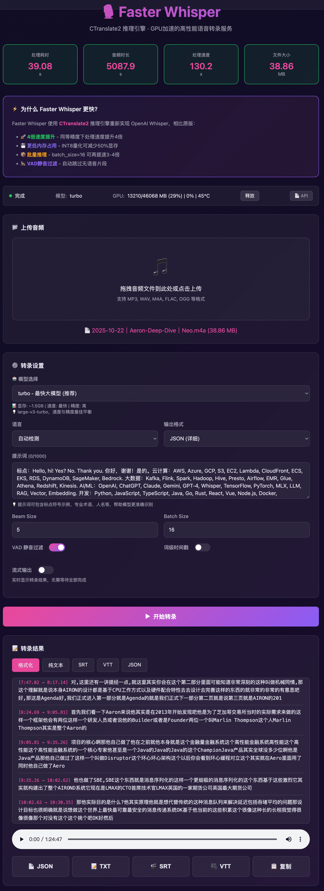

[English](README.md) | [简体中文](README_CN.md) | [繁體中文](README_TW.md) | [日本語](README_JP.md)

<div align="center">

# 🎙️ Faster Whisper Web

[](https://hub.docker.com/r/neosun/faster-whisper)
[](https://github.com/neosun100/faster-whisper-web/releases)
[](LICENSE)
[](https://github.com/OpenNMT/CTranslate2)

**GPU 加速的高性能语音转录服务**

*基于 [SYSTRAN/faster-whisper](https://github.com/SYSTRAN/faster-whisper)，使用 CTranslate2 推理引擎*



</div>

---

## ✨ 功能特性

| 特性 | 说明 |
|------|------|
| 🚀 **130倍实时速度** | 85分钟音频仅需39秒处理 |
| 🔄 **流式输出** | SSE 实时返回结果，无需等待 |
| 🎵 **交互式时间戳** | 点击时间戳跳转播放 |
| 🌐 **多语言界面** | 中文、English、繁體、日本語 |
| 📝 **多格式导出** | SRT、VTT、TXT、JSON |
| 🐳 **All-in-One Docker** | 内置 Turbo 模型，开箱即用 |
| 📄 **Swagger API** | OpenAI 兼容的 REST API |
| ⚡ **CTranslate2 引擎** | 比原版 Whisper 快 4 倍 |

## 🎯 性能基准测试

| 指标 | 数值 |
|------|------|
| 音频时长 | 5087.9秒 (85分钟) |
| 处理耗时 | 39.08秒 |
| **处理速度** | **130.2倍实时** |
| 文件大小 | 38.86 MB |
| GPU | NVIDIA L40S |
| 模型 | Turbo (FP16) |

## 🚀 快速开始

### Docker 方式（推荐）

```bash
# 拉取并运行
docker run -d --gpus all \
  -p 8600:8600 \
  --name faster-whisper \
  neosun/faster-whisper:latest

# 访问 Web 界面
open http://localhost:8600
```

### Docker Compose

```yaml
version: '3.8'
services:
  whisper:
    image: neosun/faster-whisper:latest
    container_name: faster-whisper
    ports:
      - "8600:8600"
    environment:
      - MODEL_SIZE=turbo
      - COMPUTE_TYPE=float16
    volumes:
      - whisper-cache:/root/.cache
    deploy:
      resources:
        reservations:
          devices:
            - driver: nvidia
              count: 1
              capabilities: [gpu]
    restart: unless-stopped

volumes:
  whisper-cache:
```

```bash
docker-compose up -d
```

## ⚙️ 配置说明

| 环境变量 | 默认值 | 说明 |
|----------|--------|------|
| `MODEL_SIZE` | `turbo` | 模型：tiny, base, small, medium, large-v3, turbo |
| `COMPUTE_TYPE` | `float16` | 精度：float16, int8, int8_float16 |
| `DEVICE` | `cuda` | 设备：cuda, cpu |
| `PORT` | `8600` | Web 服务端口 |
| `IDLE_TIMEOUT` | `300` | 空闲自动卸载模型（秒） |

### 指定 GPU

```yaml
# 使用指定 GPU（如 GPU 2）
deploy:
  resources:
    reservations:
      devices:
        - driver: nvidia
          device_ids: ['2']
          capabilities: [gpu]
```

## 📡 API 接口

### 转录接口（OpenAI 兼容）

```bash
curl -X POST http://localhost:8600/v1/audio/transcriptions \
  -F "file=@audio.mp3" \
  -F "model=turbo" \
  -F "language=auto" \
  -F "response_format=verbose_json"
```

### 流式转录

```bash
curl -X POST http://localhost:8600/v1/audio/transcriptions \
  -F "file=@audio.mp3" \
  -F "stream=true"
```

响应格式 (NDJSON)：
```json
{"type": "info", "language": "zh", "duration": 120.5}
{"type": "segment", "id": 0, "start": 0.0, "end": 3.2, "text": "你好"}
{"type": "segment", "id": 1, "start": 3.2, "end": 6.5, "text": "欢迎使用"}
{"type": "done"}
```

### 接口列表

| 接口 | 方法 | 说明 |
|------|------|------|
| `/v1/audio/transcriptions` | POST | 音频转录（OpenAI 兼容） |
| `/v1/models` | GET | 获取可用模型列表 |
| `/v1/models/{name}/load` | POST | 预加载模型 |
| `/api/gpu/status` | GET | GPU 状态信息 |
| `/api/gpu/offload` | POST | 卸载模型释放显存 |
| `/health` | GET | 健康检查 |
| `/docs` | GET | Swagger API 文档 |

## 🏗️ 项目结构

```
faster-whisper-web/
├── app/
│   ├── server.py          # FastAPI 服务
│   ├── templates/
│   │   └── index.html     # Web 界面
│   └── static/            # 静态资源
├── faster_whisper/        # 核心转录库
├── Dockerfile             # All-in-One 镜像
├── docker-compose.yml     # Compose 配置
├── .env.example           # 环境变量模板
└── README.md
```

## 🛠️ 技术栈

- **推理引擎**: [CTranslate2](https://github.com/OpenNMT/CTranslate2) - 优化的 Transformer 推理
- **模型**: [Faster Whisper](https://github.com/SYSTRAN/faster-whisper) - Whisper 重新实现
- **后端**: FastAPI + Uvicorn
- **前端**: 原生 JS + 现代 CSS
- **容器**: NVIDIA CUDA 12.3.2 + cuDNN9

## 📋 更新日志

### v1.3.1 (2026-01-04)
- ✨ SSE 流式输出
- ✨ 点击时间戳跳转播放
- ✨ UI 添加 Swagger API 入口
- 🐳 All-in-One Docker 内置 turbo 模型

### v1.3.0-docker (2026-01-03)
- 🐳 Docker 部署方案
- 🌐 多语言 Web 界面
- 📝 多格式导出 (SRT/VTT/TXT/JSON)
- 📊 实时 GPU 监控

## 🤝 参与贡献

欢迎提交 Pull Request！

1. Fork 本仓库
2. 创建特性分支 (`git checkout -b feature/amazing`)
3. 提交更改 (`git commit -m 'Add amazing feature'`)
4. 推送分支 (`git push origin feature/amazing`)
5. 提交 Pull Request

## 📄 开源协议

本项目采用 MIT 协议 - 详见 [LICENSE](LICENSE) 文件

## 🙏 致谢

- [SYSTRAN/faster-whisper](https://github.com/SYSTRAN/faster-whisper) - 核心转录库
- [OpenNMT/CTranslate2](https://github.com/OpenNMT/CTranslate2) - 推理引擎
- [OpenAI Whisper](https://github.com/openai/whisper) - 原始模型

---

## ⭐ Star History

[](https://star-history.com/#neosun100/faster-whisper-web)

## 📱 关注公众号

<div align="center">


</div>
